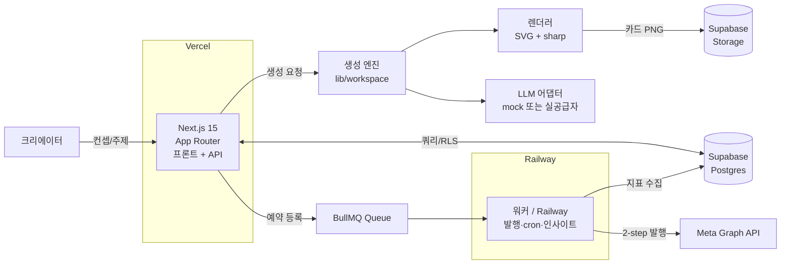

<div align="center">

# Kup

**갓 시작한 1인 인플루언서를 위한, 기획부터 발행·성과까지 한 곳에서 도는 카드뉴스 자동화 서비스**

AI가 카드뉴스를 **기획·생성**하고, 사람이 빠르게 **검수·승인**한 뒤 **예약 발행**하며,
댓글 리드마그넷·성과 분석까지 하나의 워크스페이스에서 돌립니다.

<!-- TODO: 데모/배포 링크가 생기면 추가 -->
<!-- [라이브 데모](https://...) · [기획 문서](docs/product/Kup_SPEC.md) · [기술 설계](docs/tech/Kup_기술설계.md) -->


</div>


<br/>

## 목차

1. [한눈에 보기](#1-한눈에-보기)
2. [왜 만들었나](#2-왜-만들었나)
3. [핵심 기능](#3-핵심-기능)
4. [아키텍처](#4-아키텍처)
5. [데이터 모델](#5-데이터-모델)
6. [기술 스택과 선택 이유](#6-기술-스택과-선택-이유)
7. [빠른 시작](#7-빠른-시작)
8. [로드맵](#8-로드맵)
9. [프로젝트 구조](#9-프로젝트-구조)
10. [더 읽을거리](#10-더-읽을거리)

<!-- 대표 시각자료: 생성 파이프라인이 도는 GIF 한 장을 여기에. -->
<!-- "컨셉 입력 → 카드 PNG가 out/에 생성되는" 30초 흐름이 이상적. -->
<!--  -->


<br/>

## 1. 한눈에 보기

| | |
|---|---|
| **무엇을** | 1인 인플루언서가 카드뉴스를 *빠르게 만들고 · 안전하게 검수하고 · 예약 발행하고 · 성과를 보는* 통합 도구 |
| **누구를 위해** | 팔로워 1,000명을 목표로 하는, 혼자 운영하는 초기 크리에이터 (국내 우선) |
| **핵심 모델** | **Co-pilot** — AI가 가속하되, 발행 최종 권한은 항상 사람에게 |
| **현재 구현** | AI **카드 생성(실 LLM)** · **검수·승인** · **인스타 발행** · **성과 분석** · **리드마그넷**까지 동작. **예약 발행**만 다음 단계 |
| **데이터 흐름** | `컨셉 → 생성 → deck → 렌더 → 저장 → (예약) 발행 → 성과·리드마그넷` |


<br/>

## 2. 왜 만들었나

### 문제 — 1인 운영자는 시간이 없다

갓 시작한 인플루언서는 카드뉴스 한 건을 위해 **기획 → 카피 → 디자인 → 발행 → 성과 확인**을 혼자 다 합니다.
한 건에 2~3시간이 들고, 도구는 흩어져 있으며, 꾸준한 발행은 더 어렵습니다.

### 솔루션 — 가속 · 통합 · 운영, 그리고 사람의 신뢰

Kup은 세 가지를 동시에 풉니다.

- **가속(Accelerate)** — AI가 컨셉만 받으면 카피·구성·카드 이미지 초안까지 자동 생성
- **통합(Integrate)** — 생성 · 검수 · 예약 발행 · 성과 분석 · 리드마그넷을 한 워크스페이스에
- **운영(Operate)** — 예약 발행과 자동 인사이트 수집으로 "꾸준함"을 시스템이 보조

> **차별점 — 완전 자동화가 아니라 Co-pilot.**
> AI가 만든 초안은 **사람이 검수·승인해야만** 발행됩니다. 브랜드 톤 유지와 플랫폼 리스크 회피를 위해,
> 자동화의 속도와 크리에이터의 목소리를 함께 가져가는 것이 핵심 설계 철학입니다.


<br/>

## 3. 핵심 기능

<!-- 각 기능 옆에 해당 화면 스크린샷 1장씩 넣으면 설득력이 크게 올라감 -->

| # | 기능 | 상태 | 한 줄 설명 |
|---|---|---|---|
| 1 | **AI 생성 파이프라인** | 현재 동작 | 컨셉 + 주제 → LLM 체인으로 카드뉴스 생성 (실 LLM 연동), SVG→PNG 렌더 |
| 2 | **검수·승인 워크플로우** | 현재 동작 | AI 리스크/플래그를 사람이 확인, 승인해야 발행 |
| 3 | **인스타 발행** | 현재 동작 | Meta Graph API로 인스타그램에 실제 게시 |
| 4 | **성과 분석 · 리드마그넷** | 현재 동작 | 인사이트 지표 수집 · 댓글 키워드 → 자동 DM |
| 5 | **워크스페이스 UI** | 현재 동작 | dashboard · create · review · insights 등 |
| 6 | **예약 발행** | 예정 | BullMQ + Redis 지연 작업으로 지정 시각 자동 발행 |

### 대표 기능 — AI 생성 파이프라인 *(현재 동작)*

컨셉(페르소나·톤·콘텐츠 기둥)과 주제를 입력하면 **4단계 LLM 체인**으로 카드뉴스 초안을 만듭니다.

```
주제 제안 → 전략(훅·슬라이드 구성·리드 키워드) → 카피 생성(deck JSON) → 셀프 리뷰(리스크·플래그)
```

- 각 단계마다 **Zod 스키마 검증** + 실패 시 **1회 자가 복구(repair)** 흐름
- 결과 deck을 **SVG 템플릿 → sharp**로 1080×1350 카드 PNG로 렌더
- **실 LLM 연동** — 생성은 실제 공급자(Anthropic)로 동작
- **mock도 지원** — API 키 없이 결정적(deterministic) 출력으로 개발·CI·시연 가능 (어댑터 교체점)


<br/>

## 4. 아키텍처

**같은 레포 · 같은 `lib/`를 공유하되, 배포만 둘로 나눈 모노레포 구조**입니다.
실시간 응답이 필요한 프론트+API와, 상시 떠 있어야 하는 워커의 수명주기가 다르기 때문입니다.



### 3계층 분리 (핵심 설계 결정)

| 계층 | 역할 | 위치 |
|---|---|---|
| **생성(Generation)** | 컨셉 → deck → 카드. LLM 어댑터로 공급자 교체 | `lib/workspace`(라이브) · `lib/llm` · `lib/render` |
| **데이터·발행(Data/Publish)** | Postgres(RLS), IG 토큰 암호화 보관, Graph API 발행 | `lib/db` · `lib/supabase` · `supabase/` |
| **오케스트레이션(Orchestration)** | 예약 지연 작업 · cron · 인사이트 수집 | `workers/` (BullMQ + Redis) |

### 공유 계약 (Shared Contract)

`lib/deck-schema.ts`·`lib/concept-schema.ts`가 **생성·렌더·DB·프론트가 공유하는 단일 데이터 계약**입니다.
Zod로 정의되어 런타임 검증과 타입 안정성을 동시에 보장합니다.


<br/>

## 5. 데이터 모델

PostgreSQL 14+ 테이블, **모든 테이블에 Row-Level Security(RLS)** 적용 — 사용자는 자기 데이터만 접근, 워커만 service role로 우회.

```
profiles ─┬─ subscriptions
          └─ channels ─┬─ ig_tokens (access_token_enc, 암호화)
                       ├─ channel_configs (컨셉 잠금: persona·tone·pillars)
                       └─ decks ─┬─ reviews (승인 게이트)
                                 ├─ schedules (bullmq_job_id)
                                 └─ posts ── post_insights
          channel_insights_daily / lead_magnets / dm_logs / challenge_logs
```

- **상태 전이는 enum으로 관리** — 예: `deck_status: planning → planned → producing → produced → scheduled → published`
- **IG 액세스 토큰은 절대 `.env`에 두지 않음** — OAuth로 받아 `ig_tokens.access_token_enc`에 **libsodium 암호화** 저장
- 마이그레이션은 `0001 스키마 / 0002 RLS / 0003 권한`으로 분리

> 전체 스키마·관계·RLS 정책: [docs/tech/Kup_데이터모델.md](docs/tech/Kup_데이터모델.md)


<br/>

## 6. 기술 스택과 선택 이유

| 영역 | 선택 | 왜 |
|---|---|---|
| **언어/검증** | TypeScript 5.7 · Zod | 생성 단계마다 런타임 검증이 필요 → 타입과 스키마를 한 소스로 |
| **프론트+API** | Next.js 15 (App Router) · React 19 · Tailwind 4 | 한 프레임워크에서 UI와 API 라우트를 함께, Vercel 배포 최적 |
| **DB/Auth/Storage** | Supabase (Postgres) | RLS로 멀티테넌트 보안을 DB 레벨에서, Auth·Storage까지 일괄 |
| **잡 큐/스케줄링** | BullMQ + Redis | 예약 발행의 **지연 작업**과 **cron**을 안정적으로. n8n 대비 코드 소유·테스트 용이([결정 기록](docs/tech/Kup_n8n_결정.md)) |
| **이미지 렌더** | sharp + SVG | 외부 디자인 API 없이 서버에서 1080×1350 카드 PNG를 결정적으로 생성 |
| **LLM** | Anthropic (어댑터로 공급자 교체 가능) | 실 연동은 Anthropic. 어댑터로 공급자 종속 회피 + mock으로 키 없이 개발·시연 |
| **배포** | Vercel(프론트+API) · Railway(워커) | 수명주기가 다른 두 워크로드를 분리 배포, 코드는 단일 레포 공유 |

### 짚고 넘어간 엔지니어링 디테일

- **mock-first 전략** — 외부 LLM 비용/키 없이 전체 파이프라인을 개발·CI·시연 가능하게 설계
- **의존성 핀 고정** — `bullmq`가 요구하는 `ioredis` 단일 사본으로 dedupe해 타입 충돌 제거(`overrides`)
- **의도된 스텁** — `workers/jobs/publish.ts`, `lib/sentry.ts` 등은 `TODO(Phase5)`로 명시된 빈칸(죽은 코드 아님)


<br/>

## 7. 빠른 시작

**사전 준비**: Node 20+ · Docker Desktop · Git

```bash
# 1) 클론 + 의존성
git clone <repo-url> && cd kup
npm install

# 2) 로컬 Supabase 기동 (Docker 필요)
npx supabase start            # Postgres + Auth + Storage + Studio
npx supabase db reset         # 마이그레이션 적용 (0001~0003)

# 3) 환경변수 — supabase start 출력 키를 .env.local 에 채움
cp .env.example .env.local

# 4) 구동
npm run dev                   # http://localhost:3000  (/api/health 로 확인)
```

**핵심 — 생성 파이프라인 돌려보기 (API 키 불필요, mock으로 동작):**

```bash
npm run gen                   # 컨셉 → deck JSON + 카드 PNG (out/ 에 생성)
npm run gen -- --save         # + 로컬 DB 영속화 (supabase 기동 필요)
```

| 명령 | 용도 |
|---|---|
| `npm run dev` | 프론트 + API 개발 서버 |
| `npm run gen [-- --save]` | 생성 파이프라인 (deck → PNG [→ DB]) |
| `npm run worker:dev` | BullMQ 워커 (REDIS_URL 필요) |
| `npm run typecheck` / `lint` / `build` | PR 전 필수 3종 (CI 검사 항목) |


<br/>

## 8. 로드맵

| 단계 | 내용 | 상태 |
|---|---|---|
| AI 생성 파이프라인 | 실 LLM 연동으로 카드뉴스 생성 | 완료 |
| 검수·승인 워크플로우 | AI 플래그 기반 게이트 + 사람 승인 | 완료 |
| 인스타 발행 | Meta Graph API로 실제 게시 | 완료 |
| 성과 인사이트 자동 수집 | 일별 스냅샷 · 지표 수집 | 완료 |
| 리드마그넷 (댓글 → 자동 DM) | 키워드 트리거 | 완료 |
| 워크스페이스 UI | dashboard · create · review · insights | 완료 |
| 예약 발행 | BullMQ + Redis 지연 작업 (설계 완료, 통합 예정) | 예정 |


<br/>

## 9. 프로젝트 구조

```
app/         Next.js 프론트 + API (워크스페이스 화면 + API 라우트)
components/   워크스페이스 UI 컴포넌트
lib/
  workspace/ 라이브 앱 로직 — 생성·검수·발행 (실제 MVP가 사용)
  generate/  생성 엔진(벤치/mock) — CLI·실험용
  llm/       LLM 어댑터 (Anthropic + mock 교체점)
  render/    카드 렌더 (SVG + sharp)
  db/        decks 저장·시드·DB 타입
  supabase/  client / server / admin 클라이언트
  deck-schema.ts · concept-schema.ts   공유 데이터 계약
workers/     BullMQ 워커 (발행·cron·인사이트) — 예정
supabase/    config + 마이그레이션 (0001~0003)
scripts/     생성 CLI·실험 스크립트
spike-bullmq/ 예약/cron 내구성 스파이크 (참고)
docs/        기획·기술 설계 문서 (SoT)
```


<br/>

## 10. 더 읽을거리

- **무엇을 만드나** — [Kup_SPEC.md](docs/product/Kup_SPEC.md) · [PRD](docs/product/Kup_PRD_최종.md) · [정보구조(IA)](docs/product/Kup_IA.md)
- **어떻게** — [기술 설계](docs/tech/Kup_기술설계.md) · [생성 파이프라인 설계](docs/tech/Kup_생성파이프라인_설계.md) · [데이터 모델](docs/tech/Kup_데이터모델.md)
- **운영** — [배포·운영 계획](docs/tech/Kup_배포_운영_계획.md) · [BullMQ/cron 심층](docs/tech/Kup_BullMQ_cron_심층.md)
- **팀 규칙** — [CONTRIBUTING.md](CONTRIBUTING.md)

<div align="center">

<sub>AI Camp 7기 팀 프로젝트 · gentlemen</sub>

</div>
